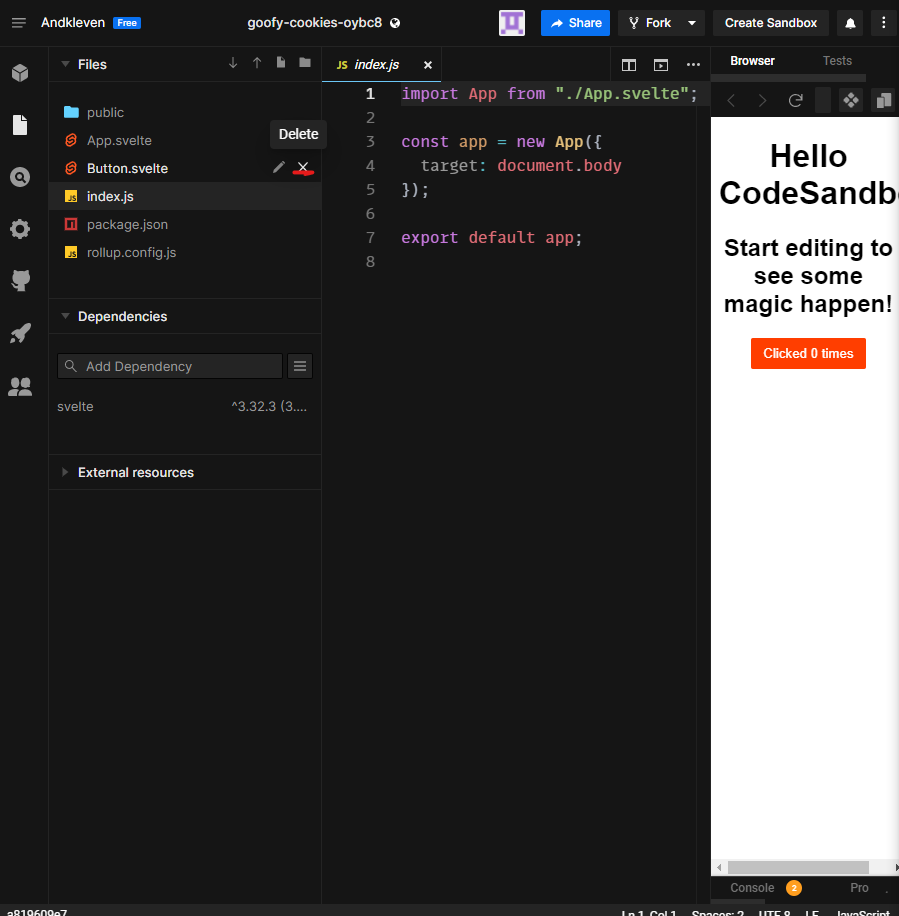
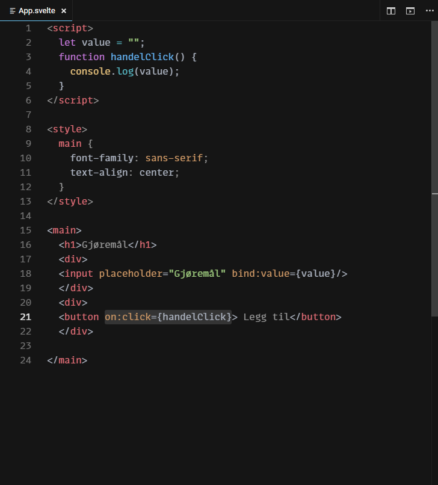

### For å komme i gang

##### [Se video](https://www.youtube.com/watch?v=kFVYiAuYDr8)
##### [Se video](https://www.youtube.com/watch?v=HIlXJpMn5n0) for å legge til Fauna(database), er ikke i tekst format 

1. Lage en [sandbox](https://codesandbox.io/dashboard/home?workspace=a5daef3d-256a-4387-a598-b09354477e5a)
   

2. Slett filen Button.svelte 

3. Slett linje 2 og linje 15 i App.svelte 
4. Ta bort linje 13 og bytt ut Hello CodeSandbox med Gjøremål i App.svelte
5. Lage et innput felt ved hjelp av [form](https://www.w3schools.com/html/html_forms.asp). Legg til dette etter linje 12 i App.svelte
   ```shell
   <form>
      <div>
         <input required placeholder="Gjøremål"/>
      </div>
      <div>
         <button> Legg til</button>
      </div>
   </form>
   ```
6. Så skal vi få ut verdien av innput feltet

   1. Legge til dette etter linje 1

   ```shell
   let value = "";
   function handelSubmit() {
      console.log(value);
   }
   ```

   1. Legg til dette etter input linje 19

   ```shell
    bind:value={value}
   ```

   1. Legg til dette etter form linje 17

   ```shell
    on:submit|preventDefault={handelSubmit}
   ```

   1. Nå burde koden din se slik ut
      

7. Skriv inn noe i innputfeltet og trykk på "legg til" og åpne console(se bilde)
   

8. Så skal vi hardkode noen gjøremål. Legge til dette etter linje 5
   ```shell
   let toDos = [{ toDo: "test1", id: Math.random() }, { toDo: "test2", id: Math.random()}];
   ```
9. Så skal vi vise frem gjøremålet med en [tabel](https://www.w3schools.com/html/html_tables.asp) og ved hjelp av en [#each](https://svelte.dev/docs#each). Legg til dette etter linje 28
   ```shell
   <div>
      <table>
         {#each toDos as toDo}
            <tr>
               <td><input type="checkbox"/></td>
               <td>{toDo.toDo}</td>
               <td><button>slett</button></td>
            </tr>
         {:else}
            <h4>Ingen Gjøremål</h4>
         {/each}
      </table>
   </div>
   ```
10. Så skal vi sentrere tabellen ved hjelp av css og [flex](https://css-tricks.com/snippets/css/a-guide-to-flexbox/).

    1. Legg til etter linje 16

    ```shell
    table {
    display: flex;
    justify-content: center;
    }
    ```

    1. Legg til på linje 33 etter div

    ```shell
    class="center"
    ```

    1. 

11. Så legger vi til [padding](https://www.w3schools.com/css/css_padding.asp) og [margin](https://www.w3schools.com/css/css_margin.asp) for å få mellomrom mellom input, button og table.

    1. Etter linje 13

    ```shell
    padding-top: 20px;
    ```

    1. Etter linje 17

    ```shell
    .add {
    margin-top: 10px;
    }
    ```

    1. På linje 34 etter først button

    ```shell
    class="add"
    ```

    1. Slik burde koden se ut nå
       

12. Så skal vi legge til gjøremålene når vi klikker på "Legg til"
    1. Ved hjelp av [array methods](https://alligator.io/js/push-pop-shift-unshift-array-methods/). Legg til dette inni handelSubmit linje 3
    ```shell
    toDos.unshift(value);
    toDos = toDos;
    ```
    1. Fjern console.log(value)
    2. Også resetter vi innputfeltet etter vi ha lagret. Legg til etter linje 5
    ```shell
    value = "";
    ```
13. Gjør det mulig å slette gjøremål.
    1. Legg til på linje 45 etter første button
    ```shell
    on:click={() => handelDelete(toDo.id)}
    ```
    1. Ved hjelp av [filter](https://developer.mozilla.org/en-US/docs/Web/JavaScript/Reference/Global_Objects/Array/filter) skal vi fjerne gjøremålet fra lista. Legg til etter linje 7
    ```shell
    function handelDelete(id) {
    toDos = toDos.filter(toDo => toDo.id !== id);
    }
    ```
14. Slik burde koden din se ut
      
    
